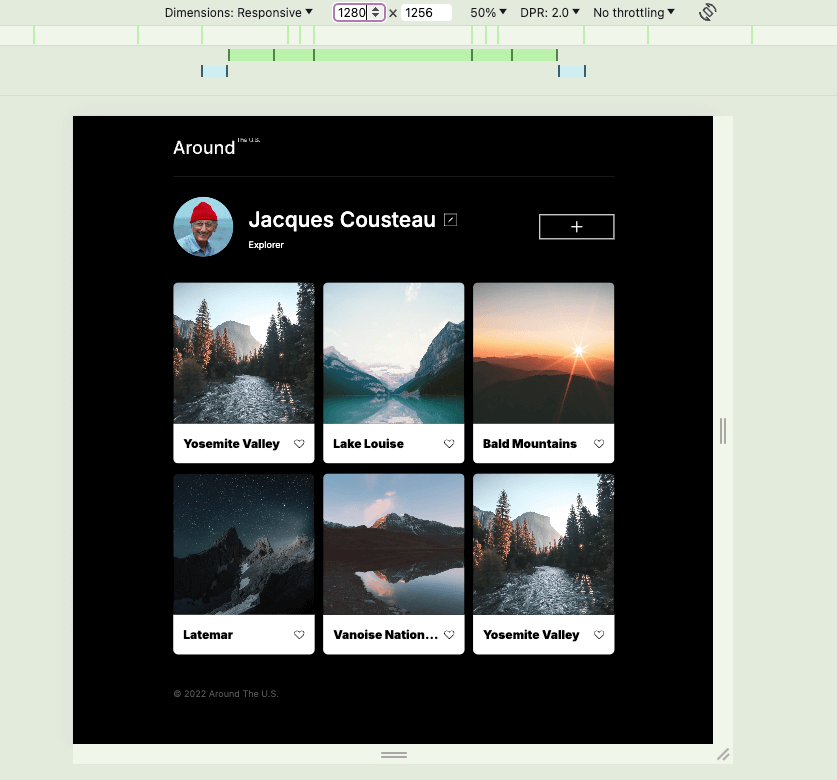
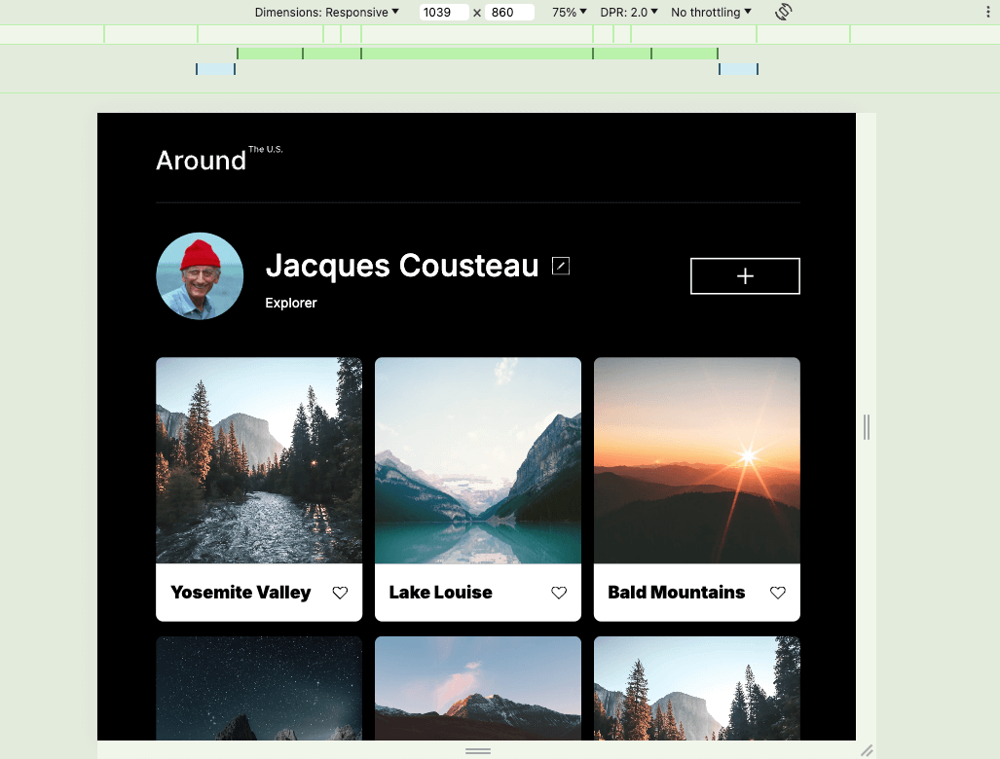
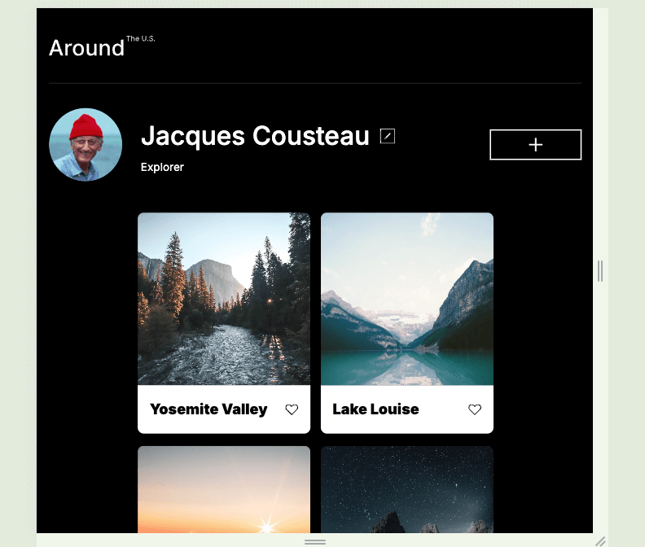
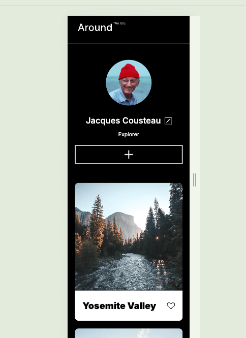

# Around The U.S.

### Overview

- [Around The U.S.](#around-the-us)
    - [Overview](#overview)
  - [Introduction](#introduction)
  - [Technologies Used](#technologies-used)
  - [Features](#features)
  - [Screenshots and GIFs](#screenshots-and-gifs)
    - [1280px View](#1280px-view)
    - [1039px View](#1039px-view)
    - [915px View](#915px-view)
    - [320px Mobile View](#320px-mobile-view)
  - [Demo](#demo)
  - [Figma](#figma)
  - [Image Optimization](#image-optimization)

## Introduction

Around The U.S. is a responsive web project designed to display various elements correctly across popular screen sizes. This project is part of a learning exercise aimed at enhancing skills in responsive design and front-end development. It is recommended to invest more time in completing this project, as it presents more complexity than previous exercises.

## Technologies Used

This project utilizes the following technologies:

- **HTML**: Structuring the content and layout of the web pages.
- **CSS**: Styling the components with emphasis on responsiveness.

## Features

- **Responsive Design**: Ensures the website is accessible and usable on a variety of screen sizes, from mobile phones to large desktop monitors.
- **Clean and Simple Layout**: Focuses on a straightforward design to showcase content effectively.
- **Optimized Performance**: Images and other resources are optimized to ensure fast loading times and efficient performance.

## Screenshots and GIFs

Below are some screenshots showcasing the key features of the project:

### 1280px View

### 1039px View

### 915px View 

### 320px Mobile View

## Demo

You can view a live demo of the project on GitHub Pages: [Around The U.S. Live Demo](https://valtsan.github.io/se_project_aroundtheus/)

You can also view a screen recording of the project on google Drive: [Around The U.S. Live Screen Recording](https://drive.google.com/file/d/1ybPtN9A--hHDLeV8DS0wJAhDjSL56qBE/view?usp=sharing)

## Figma

The design for this project can be viewed on Figma:

* [Link to the project on Figma](https://www.figma.com/file/ii4xxsJ0ghevUOcssTlHZv/Sprint-3%3A-Around-the-US?node-id=0%3A1)

## Image Optimization

All images used in this project are optimized for performance. We recommend exporting images directly from Figma and optimizing them using tools like [TinyPNG](https://tinypng.com/) to ensure your project loads faster.

Good luck and have fun!